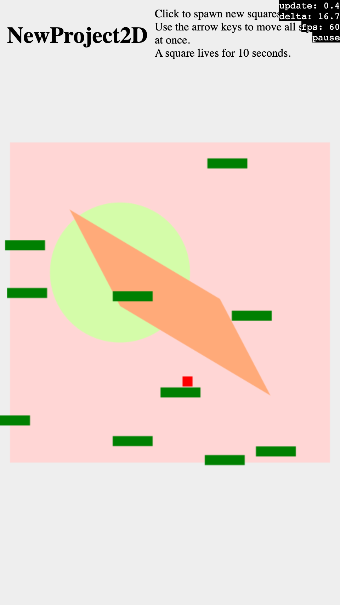
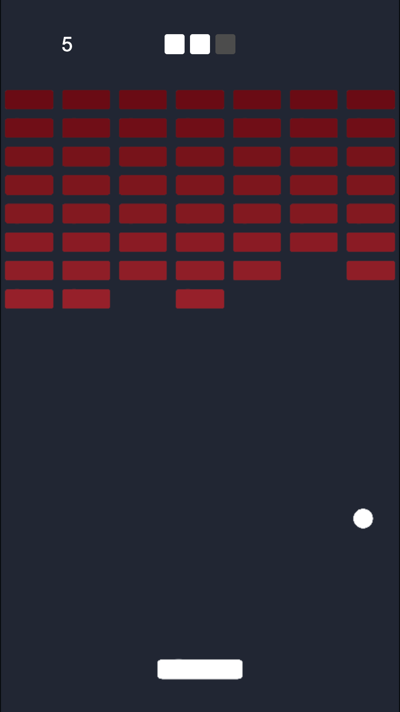
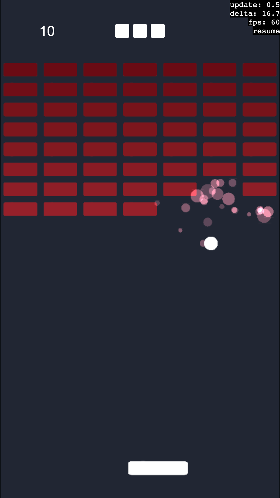

# js13kBreakout with Goodluck

This project is based on [Goodluck](https://gdlck.com), a hackable template for creating small and fast browser games.

## Live Demo

* [Play Now](https://breakouts.js13kgames.com/Goodluck/play/)

## What is Goodluck?

Goodluck is a template for creating small browser games which fit in a few kilobytes. It's designed for extreme hackability.

### A template

Goodluck is a bit unusual in that it's not a typical library; you don't import code from it to use in your project. Instead, Goodluck is a repository template — generate a new repository from it, remove the code you don't need, and hack away. This comes in handy when optimizing code for size (see below), or when you just need to hardcode something one day before the deadline.

### Entity Component System

Goodluck implements the ECS architecture.

* Game object data is stored in arrays of components, each responsible for a different concern (`LocalTransform2D`, `Render2D`, `Collide2D`, etc.).
* Entities are indices into these arrays (really, they are just `number`s). They also index a special `Signature` array which for each entity stores the bit mask of components currently enabled for it. The maximum number of components in Goodluck is 32 because JavaScript defines bitwise operations only for 32-bit integers. (Don't worry, that's more than enough for most small games!)
* Systems are called one by one, and iterate over all entities in the scene and execute logic on the entitie whose signatures match the system's query mask. The game data flows in one direction. It's stored in component arrays and goes through the systems in a deterministic order.

The ECS architecture is all about composition over inheritance.
Components can be added, removed, and re-added dynamically during the entity's lifetime.
You can mix and match different behaviors without worrying about pulling in too much logic from a superclass. As the project grows, the behaviors continue to be well isolated from each other. The ease of adding new behaviors to existing entities makes it easy and pleasant to experiment with new gameplay ideas.

### Few abstractions

The key insight of Goodluck is that abstractions, generalizations, and parametrization are responsible for a lot of cruft in the code.
And so, one of the design principles is to write simple, unsurprising code.
Systems are just functions with a `for` loop which iterates over all entities in the scene.
The code is not designed for extension in the future. The goal is to ship a game rather than build a generic engine.
This "simple" JavaScript has the benefit of usually being very fast in terms of the execution speed, which can make a difference in performance-sensitive apps, like games.

### Why not?

Goodluck and ECS are by no means perfect. It's helpful to understand their limitations and challenges they come with.

#### Why not ECS?

* One of the challenges with ECS is ordering systems correctly. It’s an inherent design problem in ECS and if done wrong, can lead to hard to track bugs.
* Related to the above, the communication between entities can be hard, confusing, or hard to follow.
* Coming from the object-oriented paradigm, sometimes it may be mildly annoying that there isn't an `update()` method that can be tweaked. Instead, you may need to write a whole new system (OTOH, they're just for loops, so it's not a lot of work), or try to find another solution, in particular for some one-off logic (like the `dispatch()` function mentioned in Step 2 below).

#### Why not Goodluck?

* Goodluck has seen usage in js13kGames, Gamedev.js, and even Ludum Dare, but it was mostly always the same people: [@michalbe](https://github.com/michalbe) and myself, [@stasm](https://github.com/stasm). There's a chance the barrier to entry for anyone else is high. (I'm trying to tear it down with this document!)
* Goodluck started out as a solution for building 3D games. In 2022 I began working on a 2D renderer and a collection of 2D systems. I'm sure there are many improvements still waiting to be made!
* As of August 2022, Goodluck doesn't have any documentation. I've been progressively documenting Goodluck's codebase in hope that I'll be able to build an API reference at one point from it. There are multiple examples in the Goodluck repo, but they don't explain what they do nor how they do it. You're on your own... Good luck, and have fun!

## The Making Of
### Step 0. Bootstrap a new project



I copy the files from a fresh Goodluck clone into this directory, and I run `./bootstrap.sh NewProject2D` to remove all other examples. I also remove directories with files that I won't need to create a 2D game: `assets`, `meshes`, and `textures`, as well as most shaders in the `materials` directory. I'll only need one shader which is used by Goodluck's default hardware-accelerated 2D renderer.

(In practice, it's often more convenient to [generate a new repository](https://github.com/piesku/goodluck/generate) using Goodluck as the template directly on GitHub. Here, however, I need to copy the files manually because I'm developing in a repository shared with other projects.)

After installing dev dependencies with `npm install`, I open the directory in VS Code and launch the build tasks with Cmd+Shift+B. This starts two parallel processes: `tsc` to type-check source files when they change, and `esbuild` to serve them at http://localhost:1234. I haven't made any changes to the code yet, so for now, the project is the default NewProject2D scene right after bootstrapping.

There is much more code that I could remove from the NewProject2D example knowing that I likely won't need it for this project. For example, I don't think I'll need the `AnimateSprite` component and the corresponding `sys_render2d_animate` system. I'm keeping them for now just in case. What I enjoy about Goodluck and more generally about the ECS architecture is that even if individual systems might appear very simple, unrelated, or not very interesting, an unusual combination of multiple systems can often yield very interesting behaviors. Some of them may be useful for debugging, too; it's best not too remove them too early.

At the end of this project I'll have another chance to remove unused components and systems to optimize the final build size.

### Step 1. Prototype the gameplay


The goal of this step is to get the rough gameplay ready to be tested and improved. I start by removing the default `scene_stage` and build my own `scene_main` with the player's paddle. The paddle is simply a red rectangle (the `draw_rect()` component mixin). It also has a dynamic collider (`collide2d(true)`), can move (`move2d()`), and can be controlled by the player (`control_player()`).

Next, I add the ball (a blue square), which can move (`move2d()`), and which uses `control_always2d()` to continue moving every frame. `Move2d` merely gives an entity the ability to move, but it still needs another system to set the movement direction, e.g. based on the user's input. Goodluck uses the convention of _control_ systems which inform other systems what to do.

Finally, I create a grid of green bricks in `scene_main`, each with a static collider (`collide2d(false)`, which means the positions of the collider is not updated each frame). I also introduce a new component bit, `Has.ControlBrick`, and a corresponding system, `sys_control_brick`. In this system, each brick checks for any collisions registered by its collider; if there were any, the brick destroys itself.

To make the ball bounce off the paddle, bricks, and the walls of the playing area, I create `sys_control_bounce`. I don't have any strict way of identifying the ball among all other entites (like I do with `Has.ControlBrick` for bricks). However, using the `Has.LocalTransform2D | Has.ControlAlways2D | Has.Collide2D` union is good enough for now. In fact, this is another thing that I enjoy about the ECS architecture — I don't actually need to special-case the ball here. Any entity with these components will get the behavior of bouncing off other game objects.

### Step 2. Minimum Shippable Product




In this step I'm going to focus on making the game look like it's supposed to. I'll also implement the full user flow, from launching the game and seeing the title screen, to starting to play, to counting and displaying the score, and finally, to having a clear lose condition.

I start by copying the assets, `block.png` and `circle.png`, into `sprites/`. There's a `Makefile` inside it which builds a single spritesheet out of all PNGs in the directory, optimized in the WEBP format. It also produces a spritesheet map, `spritesheet.ts` which is then used by `render2d` to resolve sprite names to spritesheet coordinates.

The `Render2D` component takes advantage of Goodluck's 2D renderer implemented in WebGL2. This is in contrast to the `Draw2D` component which I used in Step 1 to draw simple rectangles, and which uses the Context2D drawing API. Thanks to WebGL2's instanced drawing, `sys_render2d` renders all sprites with a single draw call, making it very fast. Modern computers and phones should be able to render 50,000 to 100,000 sprites at 60 FPS. As an additional optimization, entities with `local_transform2d()` but _without_ `spatial_node2d()` have their transformation matrix computed directly in the shader, increasing performance even further. Such entities are great for particles and background tiles; without the `SpatialNode2D` component they cannot be parents nor children of other entities.

I tweak the colors and switch `draw_rect()` to `render2d()` in all blueprints (i.e. functions that define game objects). It's time for some UI. I build it using regular HTML and CSS, which means that I can leverage the CSS Grid for creating a responsive layout, as well as many other features of the platform. To manage the UI's state, Goodluck uses a pattern which should be familiar to React developers: the UI components are defined declaratively as strings of HTML content, and read the UI's state defined on the `Game` object. The binding is one-way; to mutate the state, you need to emit an _action_ which is processed by a reducer-like function called `dispatch`. If the HTML produced by the UI components changes between frames, the _entire_ UI is updated via `innerHTML = newContent`. This is a bit like Virtual DOM diffing, except that [implemented in 4 lines of code](https://github.com/piesku/goodluck/blob/387b4f0ff0f3e10514628a1715315ea9dc4f5681/core/systems/sys_ui.ts#L11-L14) :). It's terrible for user input, but good enough for small games, usually!

The `dispatch` function is a bit of an escape hatch. Contrary to proper reducers, it's allowed to mutate the game's state and to cause side-effects. It's the perfect place to put the logic of spawning a new ball after the player loses the current one.

I define a few actions like `BrickDestroyed` and `BallOutOfBounds` and I modify `sys_control_brick` and `sys_control_bounce` to dispatch them when, respectively, a brick entity is hit by the ball and destroyed, and when the ball goes beyond the bottom edge of the scene. I also define `Game.PlayState` which is an enum of `Title`, `Playing`, `BallLost`, and `GameOver`. I'll use it to transition between the "views" of the game, and to know which UI component should be visible.

Lastly, I add `logo.png`, which is displayed on the title screen. It's an 8KB image and takes half of the build size, but that's OK for this project. In fact, I quite like it as an illustration of how small the code really is compared to a single image file!

### Step 3. Add polish



The game is already looking good. I can now spend some time adding non-critical features with the goal of improving the user's experience and making the game _feel_ better.

I start by adding mouse and touch input. The control scheme is simple enough that I don't need to handle mouse and touch separately. I rename `sys_control_mouse` to `sys_control_pointer` and I use `viewport_to_world()` from `common/input.ts` to convert the pointer coordinates in pixels to world coordinates. Goodluck uses abstract "world" units which don't easily translate into pixels. Instead, `viewport_to_world()` takes into account the position and the projection of the camera.

I could also add logic to capture the mouse pointer, but then I'd actually need a separate system for handling mouse input. When the pointer is captured, mouse events don't have absolute positions attached to them and instead only report movement deltas.

I want to be able to emit particles when the ball hits a brick. Goodluck2D is still a young project and as of August 2022 doesn't come with a particle emitter built-in. (Previously, Goodluck focused on 3D games.) However, I should be able to create my own emitter by combining a few existing systems, and adding one custom one. First, I create `blueprint_boom()` which will be instantiated at a brick's position when it's destroyed. It will be a short-lived entity that creates particles around the collision. I give it a `lifespan()` to make it self-destruct after a few tenths of a second, and `spawn()` to make it spawn particles. Next, I create `blueprint_particle()` with `lifespan()`, `move2d()`, `control_always2d()`, `render2d()` and `order(1)` to make sure particles are drawn on top of everything else. Inside the blueprint function I randomize some parameters of a single particle, like its initial size, movement direction, speed, and alpha. I also add a new system, `sys_control_particle`, to be able to add a bit of custom logic to particles. Namely, I want to reduce their size, speed and alpha over time. Because this is a small and simple game, I'm able to get away with using the `Has.Lifespan | Has.Render2D | Has.LocalTransform2D | Has.Move2D` union to identify particles. In a larger project, I'd probably create a new component bit, `Has.Particle`, possibly with some particle-specific component data, like the start and the end speed, size, and color, to help with interpolating these properties properly. For now, I scale them down by `1 - delta` in each frame; it's not perfect but certainly good enough.

To make the particles look better I switch to additive blending. Because all entities are rendered in a single instanced draw call, the change is global. This is OK for this game, but I may need to batch drawing based on the blending mode in upstream Goodluck in the future (https://github.com/piesku/goodluck/issues/116).

Next, I add sound effects. Goodluck comes with its own work-in-progress audio synthesizer and playback system, which is based on the WebAudio API. It works best for 3D games (it supports spatial audio sources and listeners) but unfortunately the [synth editor](https://stasm.github.io/havefun/) is limited in features and not very user friendly as of August 2022. For js13kBreakout, I'm going to use [@KilledByAPixel](https://github.com/KilledByAPixel)'s excellent [ZzFX](https://killedbyapixel.github.io/ZzFX/) instead. I copy `zzfx.js` into `vendor/` and adapt it slightly to make it work well with TypeScript. I then define a few more actions, like `BallHitPaddle` and `BallHitEdge`, and I dispatch them from `sys_control_bounce`. This allows me to call `zzfx()` inside `dispatch()` when I process these actions.

Being granular about these `BallHit...` actions has the added benefit of making it very easy to implement two extra features. In `BallHitBrick` (previously called `BrickDestroyed`) I can add logic to save a new high score into `localStorage`. I also add a new state variable, `Game.Streak`, which I increment in `BallHitBrick` and reset in `BallHitPaddle` and `BallOutOfBounds`. With this change, the scoring logic becomes a bit more interesting — you get more points the longer the ball is on the loose.

For a bit of more challenge, I wrap up by increasing the ball's speed. The game's ready to ship!

### Step 4. Optimize!

Optimizing the final build size is one of my favorite parts of every js13kGames edition. For the sake of this write-up's brevity, however, I'll only make one more change to the codebase, and describe a number of ideas for size optimizations that I would typically pursue.

The change that I make is to remove systems which I ended up not using. Rigid body physics, sprite animation, shake, toggle (which turns other compnents on and off on an entity), trigger (which dispatches actions on collisions), and the task system (which schedules callbacks to run in the future). For js13kBreakout, I only remove them from `game.ts` where they're called, leaving all the implementation and component files intact. This way you are free to add them back, dear reader, to tinker with js13kBreakout yourself! Without physics, I can also get away with all of my game logic running inside the framerate-dependent `FrameUpdate()` and not worry about fixed-step updates. The build size goes down from 16,456 bytes to 15,859 bytes. Pretty good!

Now, let's talk about other optimization opportunities.

The first thing that comes to mind is the `logo.png` file. It currently takes half of the ZIP file! In a real js13kGames entry I'd replace it with an SVG file or even HTML with some CSS positioning. The downside of such an approach is that the logo wouldn't look the same for all users and on all platforms, but I'd be willing to trade that for the extra kilobytes. I would also try to inline the logo file instead of putting it into the ZIP as a separate file. There's a small fixed cost for every file added to a ZIP archive and inlining resources is usually a good practice for size-constrained projects.

To guide my further search for optimization, I turn to the output of `esbuild` from the build pipeline. It produces a sorted list of files which contributed the most to the size of the bundle. The values here are helpful but need to be taken with a grain of salt. The sizes reported are for files _after_ tree shaking (good), but before stripping TypeScript typings (bad). They also don't take into account how well a file may compress.

```
  index.js                                      58.4kb  100.0%
   ├ ../common/game.ts                           7.5kb   12.8%
   ├ ../vendor/zzfx.ts                           3.0kb    5.1%
   ├ ../materials/mat_render2d.ts                2.8kb    4.9%
   ├ ../src/ui/App.ts                            2.8kb    4.8%
   ├ ../src/actions.ts                           2.3kb    4.0%
   ├ ../src/systems/sys_control_bounce.ts        2.3kb    3.9%
   ├ ../src/systems/sys_transform2d.ts           2.2kb    3.7%
   ├ ../src/systems/sys_collide2d.ts             1.7kb    2.9%
   ...                                             ...     ...
```

Looking at `common/game.ts` I notice that I don't need my `Game` class to inherit from `Game3D`. Instead, I can extend the base `GameImpl` class and just copy a few extra properties from `Game3D`, such as the "scene" canvas with the WebGL2 context, and the "background" canvas with the Context2D API. There's also quite a lot of general input-handling logic in the base `GameImpl` class, as well as some performance measurements, both of which I can remove. For example, I don't actually need to handle the `mousedown` and `mouseup` events because I only ever check for the pointer's position. I also don't need to keep track of the distance the pointer traveled while a given mouse button was pressed (useful for telling apart short clicks from longer dragging gestures). The same goes for touch input. I can also remove the support for the framerate-independed `FixedUpdate()` altogether.

I also realize that ever since I switched to using sprites and `render2d()` instead of green and red rectangles, the only part of the game that still uses `sys_draw2d` (the Context2D drawing API) is the vertical gray rectangle in the background. It sits in the middle of the scene at `[0, 0]`, same as the camera, which means that it's actually rather easy to hardcode `sys_draw2d` to only draw this one particular rectangle every frame.

The rendering system supports multiple cameras, which aren't needed in js13kBreakout. There's also a special mode of resizing the camera's orthographic projection in a way which maintains constant pixel size, which can help pixel art sprites look crisp. I don't need it here either.

A few components store data that I don't need. For instance, the `Lifespan` component can store an optional `Action` which is dispatched when the entity self-destructs. The collision detection system supports bitflag layers which can be used to model advanced rules of interaction between entities. I don't need either of these features in js13kBreakout.

None of the game's objects is defined as a hierarchy of entites (a scene graph). There are no child entities; all entities are top-level. I could remove the `Children` component, which represents the `is-parent-of` relationship. I could also consider removing the `SpatialNode2D` component, which represents the `is-child-of` relationship, as well as stores the world-space transformation matrix. When all entities are guaranteed to be top-level, their local transform _are_ the world transforms. Removing `SpatialNode2D` would open up a few other optimizations in the rendering system.

At this point I also know the final size of the spritesheet so I could hardcode it directly in the shader rather than store it and pass it as a uniform. And last but not least, I should minify the shader. I usually do it manually. If you know a tool that can do it for me, please let me know!

I find that optimizing Goodluck projects for size is relatively easy. Goodluck lends itself well to refactors:

* All the code lives in the project. There are no dependencies.
* The game data is well-defined in components by means of TypeScript interfaces. Refactors are easy and safe.
* The game logic is well isolated into systems. For instance, if your game doesn't need physics, remove the physics system.

I also usually avoid golfing my code. Minification and compression are so unpredictable that there really is no telling whether a particular micro-optimization in the source code will have any positive impact on the build size. Additionally, the simpler the code, the more likely it is that it will compress better. For instance, it's often better to repeat some code in a few places than it is to factor it out to its own function. Abstractions increase the entropy of the codebase, while repetition doesn't.


## What's Next?

Checkout the examples and the game showcase at [gdlck.com](https://gdlck.com), and generate a new project from [piesku/goodluck](https://github.com/piesku/goodluck).

And if you're looking for a challenge, try extending js13kBreakout by:

* Adding camera shake when the ball hits a brick.
* Making the ball leave a trail of particles in its wake.
* Flashing the background whem a brick is destroyed.
* Spawning power-ups from destroyed bricks.
* [...and many many more!](https://www.youtube.com/watch?v=Fy0aCDmgnxg)

## Running Locally

To run locally, install the dependencies and start the local dev server:

    npm install
    npm start

Then, open http://localhost:1234 in the browser. In VS Code, Ctrl+Shift+B will show the available build tasks, including `npm start`, and F5 will open the browser.

To produce an optimized build in `play/index.zip`, use the included `Makefile`. You'll need the 7-Zip command line utility installed.

    make -C play index.zip
