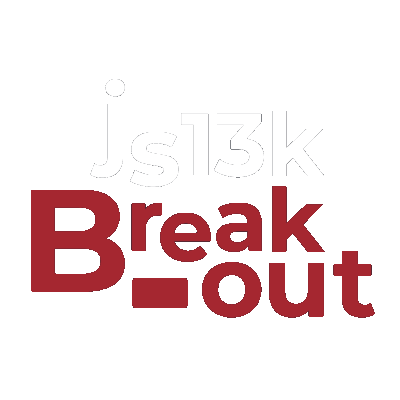
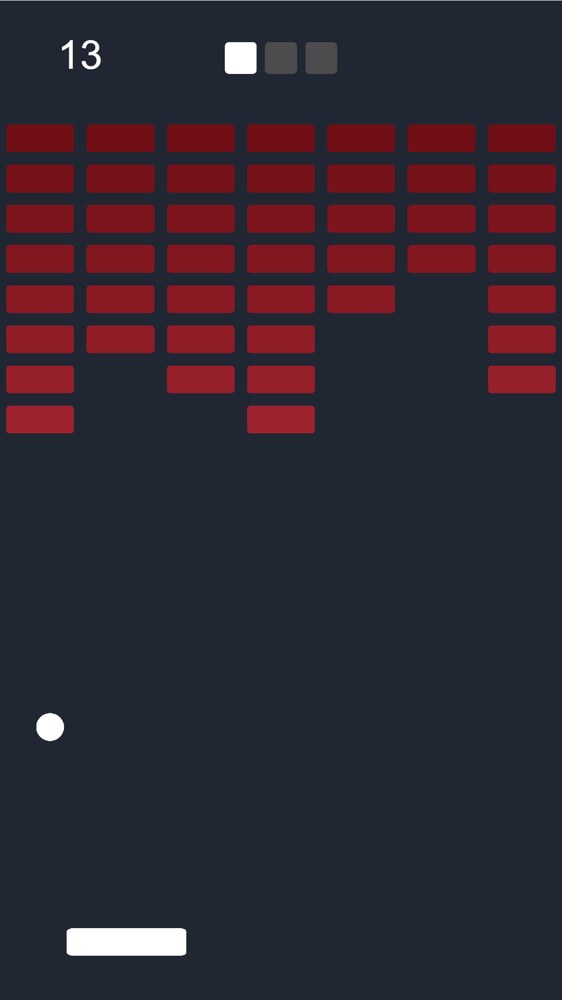

# js13kBreakouts

We implemented the same breakout style game with small libraries/engines/templates for the [js13kGames competition!](https://js13kgames.com)

# Live Demos

### [LittleJS](https://breakouts.js13kgames.com/LittleJS) - Small JavaScript game engine with a fast hybrid rendering system
### [Goodluck](https://breakouts.js13kgames.com/Goodluck/play) - Hackable template for creating small and fast browser games
### [Kontra](https://breakouts.js13kgames.com/Kontra.js) - Lightweight JavaScript gaming micro-library

# Screenshot

